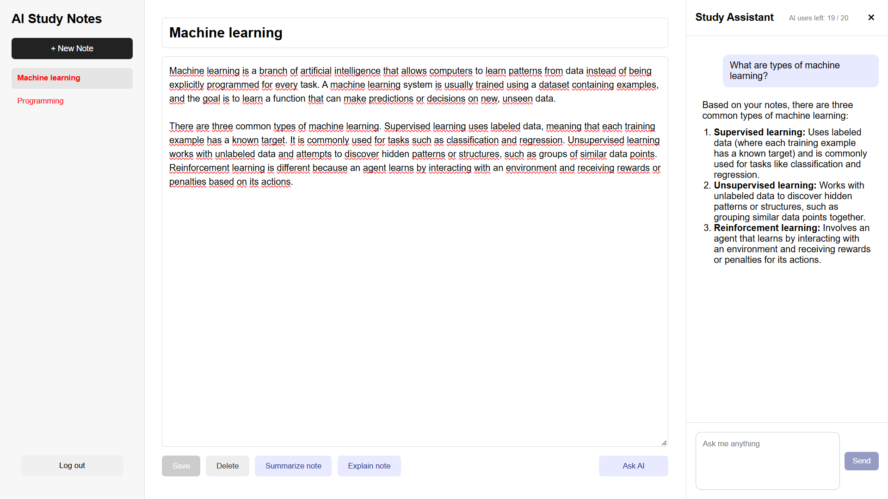
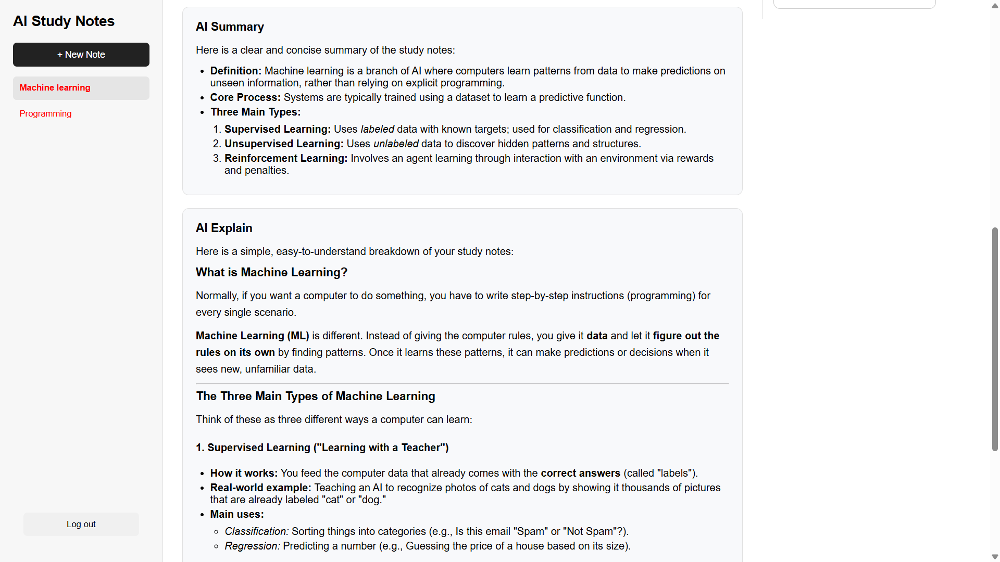

# Study-Note

An AI-powered note-taking web application for creating, organizing, and understanding study notes.

Study-Note combines a simple note editor with AI-powered tools that can summarize, explain, and chat about notes, helping students review and understand their study material more efficiently.

## Live Demo

**[Try Study-Note](https://study-note-frontend.onrender.com)**

The application is deployed using Render.

---

## Screenshots

### Notes



### AI Summarization



---

## Features

* 📝 Create, edit, and delete study notes
* 📚 Manage personal study notes
* 🤖 AI note summarization, explanation, and chat
* 🔐 User registration and login
* 🔑 JWT-based authentication with access and refresh tokens
* 🍪 Secure HTTP-only refresh-token cookies
* 👤 User-specific notes and data isolation
* 🛡️ API rate limiting
* 🔒 Security headers with Helmet
* 🌐 Production frontend and backend deployment

---

## Tech Stack

### Frontend

* React
* TypeScript
* Vite
* Axios
* React Hot Toast
* Lucide React

### Backend

* Node.js
* Express
* TypeScript
* MongoDB
* Mongoose
* JWT
* bcrypt
* express-rate-limit
* Helmet

### AI

* Google Gemini API

### Deployment

* Render
* MongoDB Atlas

---

## Architecture

Study-Note uses a separate frontend and backend architecture:

```text
┌──────────────────────┐
│      React + Vite    │
│      TypeScript      │
│                      │
│     Study-Note UI    │
└──────────┬───────────┘
           │
           │ HTTP / Axios
           │ JWT Access Token
           │ HTTP-only Cookie
           ▼
┌──────────────────────┐
│   Express + Node.js  │
│      TypeScript      │
│                      │
│  Authentication      │
│  Notes API           │
│  AI API              │
│  Rate Limiting       │
└───────┬────────┬─────┘
        │        │
        │        │ Google Gemini API
        │        ▼
        │   ┌──────────────┐
        │   │ Google Gemini│
        │   │     API      │
        │   └──────────────┘
        │
        ▼
┌──────────────────────┐
│    MongoDB Atlas     │
│                      │
│ Users                │
│ Notes                │
│ Refresh Tokens       │
└──────────────────────┘
```

---

## Authentication

Study-Note uses an access-token and refresh-token authentication system.

### Access Token

After login, the backend issues a short-lived JWT access token.

The frontend keeps the access token in memory and sends it with authenticated API requests:

```http
Authorization: Bearer <access-token>
```

### Refresh Token

A longer-lived refresh token is stored in an HTTP-only cookie.

When the access token expires, the frontend requests a new access token through the refresh endpoint without requiring the user to log in again.

Refresh tokens are stored in the database as hashes rather than plaintext tokens.

### Protected Routes

Authenticated routes are protected by authentication middleware.

Users can only access their own notes.

---

## AI Features

Study-Note uses the Google Gemini API to provide AI-powered study assistance.

### Summarize

Users can send the content of a note to the AI and receive a shorter summary containing the key information.

### Explain

Users can ask the AI to explain the content of a note in a clearer and easier-to-understand way.

### Chat

Users can chat with the AI about the note to get better understanding of the content, or even asking questions outside the scope of it.

AI endpoints are protected by authentication and rate limiting to help control API usage.

---

## Security

The application includes several security measures:

* JWT-based authentication
* Short-lived access tokens
* HTTP-only refresh-token cookies
* Hashed refresh tokens in MongoDB
* Authentication middleware for protected routes
* User-level data isolation
* Authentication rate limiting
* AI-specific rate limiting
* Input length validation
* JSON request-size limits
* Helmet security headers
* Restricted CORS configuration

> **Important:** Never commit `.env` files, API keys, database credentials, JWT secrets, or other sensitive credentials to the repository.

---

## Project Structure

```text
Study-Note/
│
├── frontend/
│   ├── src/
│   │   ├── components/
│   │   ├── App
│   │   ├── css
│   │   ├── lib/
│   │   └── ...
│   ├── package.json
│   └── ...
│
├── backend/
│   ├── src/
│   │   ├── controllers/
│   │   ├── middleware/
│   │   ├── models/
│   │   ├── routes/
│   │   ├── services/
│   │   └── ...
│   ├── package.json
│   └── ...
│
└── README.md
```

---

## Getting Started

### Prerequisites

Make sure you have the following installed:

* [Node.js](https://nodejs.org/) 22 or later
* npm
* MongoDB Atlas account
* Google Gemini API key

### Installation

Clone the repository:

```bash
git clone https://github.com/Xlire/Study-Note
cd Study-Note
```

### Backend

Navigate to the backend:

```bash
cd backend
```

Install dependencies:

```bash
npm install
```

Create a `.env` file:

```env
MONGODB_URI=your_mongodb_connection_string

ACCESS_TOKEN_SECRET=your_access_token_secret

REFRESH_TOKEN_SECRET=your_refresh_token_secret

GEMINI_API_KEY=your_gemini_api_key

NODE_ENV=development

FRONTEND_URL=http://localhost:5173
```

Start the backend development server:

```bash
npm run dev
```

The backend will run on:

```text
http://localhost:5001
```

### Frontend

Open another terminal and navigate to the frontend:

```bash
cd frontend
```

Install dependencies:

```bash
npm install
```

Create a `.env` file:

```env
VITE_API_URL=http://localhost:5001/api
```

Start the frontend:

```bash
npm run dev
```

The frontend will normally be available at:

```text
http://localhost:5173
```

---

## Environment Variables

### Backend

| Variable               | Description                                   |
| ---------------------- | --------------------------------------------- |
| `MONGODB_URI`          | MongoDB Atlas connection string               |
| `ACCESS_TOKEN_SECRET`  | Secret used to sign access tokens             |
| `REFRESH_TOKEN_SECRET` | Secret used to sign refresh tokens            |
| `GEMINI_API_KEY`       | Google Gemini API key                         |
| `NODE_ENV`             | Application environment                       |
| `FRONTEND_URL`         | URL allowed by the backend CORS configuration |

### Frontend

| Variable       | Description          |
| -------------- | -------------------- |
| `VITE_API_URL` | Backend API base URL |

Never commit actual values for these variables to Git.

---

## Production Deployment

The application is deployed using Render.

### Frontend

The React/Vite frontend is deployed as a Render Static Site.

**Build Command:**

```bash
npm install && npm run build
```

**Publish Directory:**

```text
dist
```

### Backend

The Express/TypeScript backend is deployed as a Render Web Service.

**Build Command:**

```bash
npm install --production=false && npm run build
```

**Start Command:**

```bash
npm start
```

The production environment uses:

```env
NODE_ENV=production
```

This enables production-specific security settings such as secure refresh-token cookies.

---

## API Overview

### Authentication

| Method | Endpoint        | Description            |
| ------ | --------------- | ---------------------- |
| `POST` | `/api/register` | Register a new user    |
| `POST` | `/api/login`    | Log in                 |
| `POST` | `/api/refresh`  | Get a new access token |
| `POST` | `/api/logout`   | Log out                |

### Notes

| Method   | Endpoint         | Description          |
| -------- | ---------------- | -------------------- |
| `GET`    | `/api/notes`     | Get the user's notes |
| `POST`   | `/api/notes`     | Create a note        |
| `PUT`    | `/api/notes/:id` | Update a note        |
| `DELETE` | `/api/notes/:id` | Delete a note        |

### AI

| Method | Endpoint            | Description            |
| ------ | ------------------- | ---------------------- |
| `POST` | `/api/ai/summarize` | Summarize note content |
| `POST` | `/api/ai/explain`   | Explain note content   |

All note and AI endpoints require authentication.

---

## What I Learned

This project was built as a hands-on full-stack application to strengthen my experience with modern web development.

Through the project, I worked with:

* Building REST APIs with Express and TypeScript
* React state management and component-based UI development
* MongoDB and Mongoose data modeling
* JWT authentication
* Access and refresh token
* Axios
* Rate limiting
* Input validation
* CORS and security headers
* AI API integration
* Production deployment
* Debugging differences between local and production environments

---

## Future Improvements

Potential future improvements include:

* [ ] General API rate limiter and users' notes limit
* [ ] Note search and filtering
* [ ] Note folders and tags
* [ ] Improved AI study features
* [ ] Streaming AI responses
* [ ] Improved UI

---

## License

This project is currently intended as a personal portfolio project.

---

## Author

**Toan Thien Vu**

IT / Signal Processing and Machine Learning student at Tampere University.

* GitHub: [@Xlire](https://github.com/Xlire)
* LinkedIn: [LinkedIn](https://www.linkedin.com/in/toan-thien-vu-747912308/)
